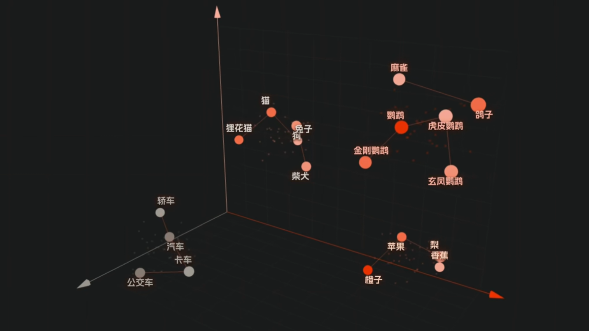

## NLP

自然语言处理（Natural Language Processing，NLP）

NLP技术使得计算机能够执行各种复杂的语言处理任务，如**中文分词、子词切分、词性标注、文本分类、实体识别、关系抽取、文本摘要、机器翻译、自动问答**等。这些任务不仅要求计算机能够识别和处理语言的表层结构，更重要的是可以理解语言背后的深层含义，包括语义、语境、情感和文化等方面的复杂因素。

例如：文本分类  
假设有一个文本分类任务，目的是将新闻文章分类为“体育”、“政治”或“科技”三个类别之一。
```text
文本：“NBA季后赛将于下周开始，湖人和勇士将在首轮对决。”
类别：“体育”

文本：“美国总统宣布将提高关税，引发国际贸易争端。”
类别：“政治”

文本：“苹果公司发布了新款 Macbook，配备了最新的m3芯片。”
类别：“科技”
```


## 文本表示
*将文本数据数字化*，使计算机能够对文本进行有效的分析和处理。

### 词向量

向量空间模型通过将文本（包括单词、句子、段落或整个文档）转换为高维空间中的向量来实现文本的数学化表示。在这个模型中，每个维度代表一个特征项，而向量中的每个元素值代表该特征项在文本中的权重

例如一个二维的模型，有两个特征值：适合当作宠物程度，飞行能力
对于词语分别为：汽车(0,0)，狗(9,0)，鹦鹉(8,9)，虎皮鹦鹉(8.5,9)

通过用这种特征项的方式可以表示所有的词语和文本，特征项越多，表示的方式也就越准确并且覆盖更多词语，但是人工来做面临的问题是：  
特征值可能非常大，人工维护复杂而且容易遗漏，也不可能覆盖所有特征。因此真实是设置好维度的数量，让计算机自己训练学习，在训练的过程中，相似的词语就会在高维向量空间中逐渐靠近，最终每个词都会变成一组高维数字。  
$$
\mathbf{v}_{\text{虎皮鹦鹉}} = [0.41, -0.12, 0.77, 0.08, -0.55, \dots]^{\top}
$$




## Transformer

Query（查询值）、Key（键值）和 Value（真值）