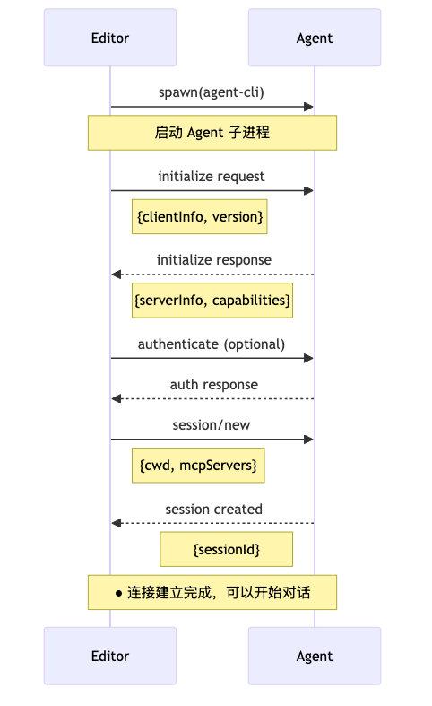

## 通信
ACP 采用 JSON-RPC 2.0 协议，基于 stdio（标准输入输出）进行通信。

## methods
| 方法 | 类型 | 说明 |
|---|---|---|
| initialize | Request | 初始化连接，交换能力信息 |
| authenticate | Request | 身份验证（可选） |
| session/new | Request | 创建新的对话会话 |
| session/prompt | Request | 向 Agent 发送用户消息 |
| session/update | Notification | Agent 推送会话更新 |
| session/request_permission | Notification | Agent 请求用户权限 |
| fs/read_text_file | Request | 读取文件内容 |
| fs/write_text_file | Request | 写入文件内容 |
| end_turn | Notification | Agent 完成一轮响应 |

## 流程

**client**-------------------------**agent**

initailize request---->  
    <------------------------------initailize response

session/new----------->  
    <------------------------------sessionId

session/prompt-------->  
    <------------------------------session/update("你好，")  
    <------------------------------session/update("有什么可以")  
    <------------------------------session/update("帮你的吗？")  
    <------------------------------session/update(token usage)      
    <------------------------------end_turn