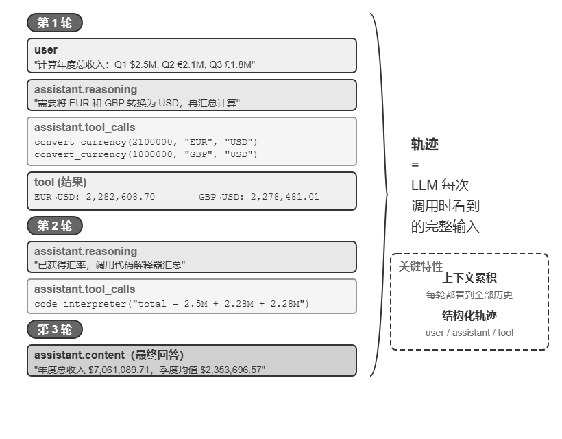

# Agent基础知识

## Agent = LLM + 上下文 + 工具

## 上下文：Agent 的眼睛
上下文是 Agent 在每个决策点能看到的全部信息。每次调用 LLM 时的上下文由以下五个部分构成：  
前两项（系统提示词 + 工具定义）是**静态前缀**，后三项（用户消息 + 模型回复 + 工具执行结果）是随交互不断增长的动态消息历史

- 系统提示词（System Prompt）：系统提示词由开发者编写，在整个对话过程中保持不变，相当于 Agent 的“岗位说明书”——定义它的身份、权限和行为准则。系统提示词中还会包含跨会话保存的用户记忆（用户偏好、历史行为、背景设定等个性化信息）和动态注入的环境状态。
- 工具定义（Tool Definitions）
- 用户消息（User Messages）：用户消息中还可能包含通过 RAG 动态检索引入的外部知识
- 模型回复（Assistant Messages）：模型之前生成的回复，最多包含三个部分——思考过程（reasoning，即内部思考链，保持思维连贯性和决策可解释性），文本内容（即对用户的回复），工具调用请求（tool_calls）
- 工具执行结果（Tool Results）：Agent 框架执行工具后返回的结果。

## ReAct 循环
循环包含三个环节：模型先思考当前应该做什么，然后调用工具行动，再观察工具返回的结果并继续思考下一步

轨迹是 Agent 在执行任务过程中不断积累的消息历史——用户消息、模型回复（包括思考过程和工具调用）、工具执行结果。每一次调用 LLM 时，它接收的完整上下文由静态前缀（系统提示词 + 工具定义）和轨迹（动态消息历史）两部分组成

## Harness
最小可工作的 Agent 只需要 LLM、上下文与工具就能跑起来，但存在明显的脆弱点：模型可能产生幻觉（编造不存在的工具或参数）、选错工具、或在遇到错误时无法自我恢复

Harness 的核心就是原公式中的"上下文 + 工具"，再加上三层保障机制：**约束**（限定 Agent 能做什么、不能做什么）、**验证**（检查 Agent 做得对不对）和**纠正**（做错了怎么补救）。

| 功能 | 一句话职责 | 与上下文/工具的关系 |
|---|---|---|
| **Context（上下文）** | 为模型提供感知信息 | 核心能力 |
| **Tools（工具）** | 为模型提供行动手段 | 核心能力 |
| **Constrain（约束）** | 设定行为边界——能做什么、不能做什么 | 围绕上下文和工具构建的安全边界 |
| **Verify（验证）** | 自动判断操作结果的对错 | 围绕工具执行结果构建的检查机制 |
| **Correct（纠正）** | 发现问题时自动修正或回退 | 围绕工具调用失败构建的恢复机制 |   

