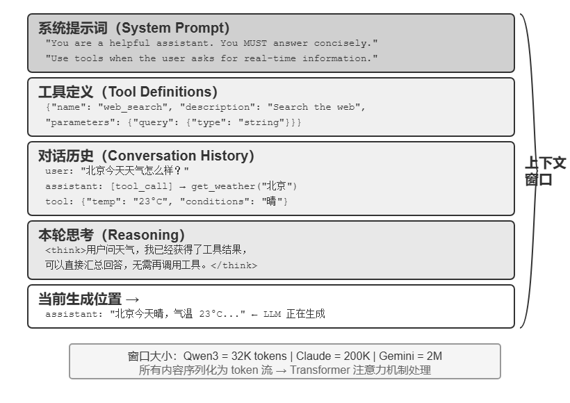
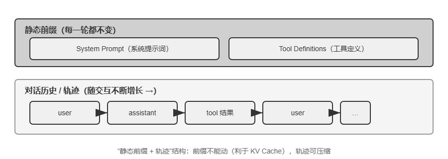
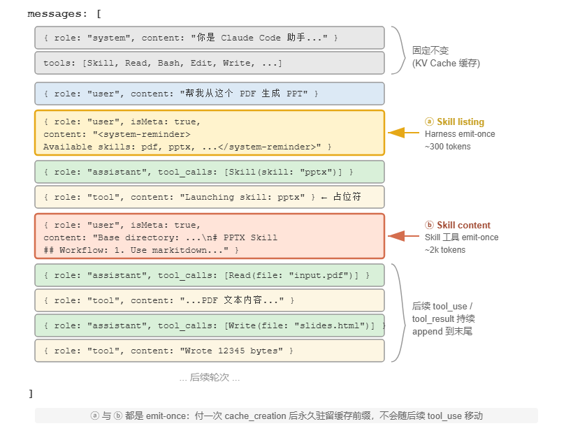
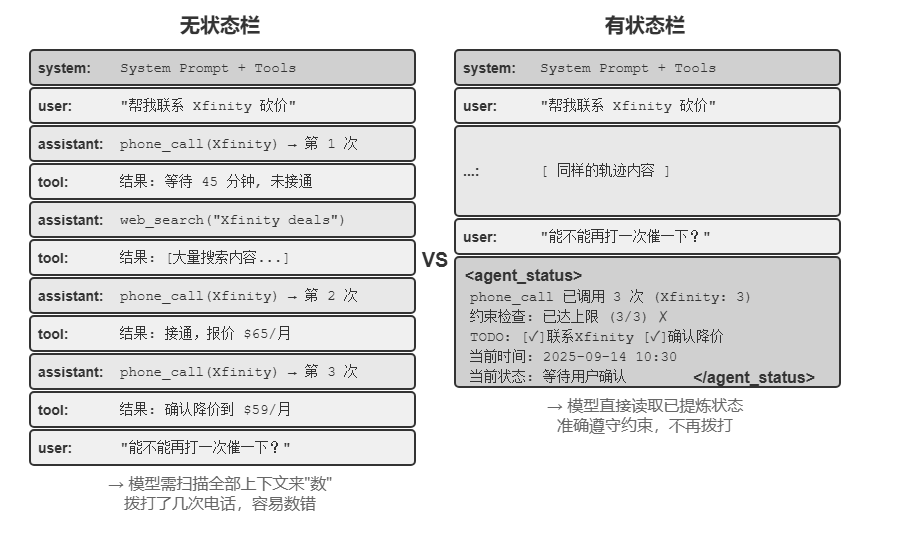

# 上下文工程

## API 的上下文结构

大模型 API 的核心是一个**消息列表**（messages），列表中的每条消息都有一个**角色**（role）标识，模型根据角色来理解每条消息的含义和来源：

- **system**：系统提示词。由开发者编写，定义 Agent 的身份、行为规则、约束条件。模型将其视为最高优先级的指令。整个对话过程中通常只有一条，放在消息列表的最前面。
- **user**：用户消息。来自终端用户的输入，是 Agent 需要响应的请求。
- **assistant**：助手消息。模型之前的回复，包括文本回复和工具调用请求。在多轮对话中，之前的 assistant 消息会被放回消息列表，让模型"记住"自己说过什么。
- **tool**：工具结果。Agent 框架执行工具后，将结果以 tool 角色的消息送回给模型。每条 tool 消息通过 `tool_call_id` 与对应的工具调用请求关联。

此外，工具定义（tools）作为请求的独立字段（而非消息），告诉模型有哪些工具可以使用、每个工具接受什么参数。




### 多轮对话
模型的API 是一个“无状态” API，即服务端不记录用户请求的上下文，用户在每次请求时，需将之前所有对话历史拼接好后，传递给对话 API。

关键：
1. **第二次请求包含了第一次的全部对话历史**——system 消息、user 消息、第一次的 assistant 回复（包含工具调用），以及新增的 tool 结果。这就是前面所说的“每次调用都是无状态的”：模型不会“记住”上一次的对话，Agent 框架必须每次都把完整历史送回去。
2. tool 消息通过 `tool_call_id` 与对应的工具调用关联——模型据此知道哪个结果对应哪个调用。


具体可以尝试 `simple-agent.py`，从这个过程可以清楚地看到：**Agent 框架的核心工作就是管理这个 messages 列表**
```json
messages = [
  { role: "system",    content: "..." },
  { role: "user",      content: "What's the current time..." },
  { role: "assistant", tool_calls: [get_current_time, get_weather] },
  { role: "tool",      tool_call_id: "call_abc", content: "{time...}" },
  { role: "tool",      tool_call_id: "call_def", content: "{weather...}" },
  { role: "assistant", content: "It's currently Saturday, Sep 13, 2025 in Vancouver..." },  # + Final reply
]
```




## 提示工程：优化系统提示词
提示工程（Prompt Engineering）的核心对象是系统提示词（System Prompt）——API 消息列表中那条 role: "system" 的消息。它是 Agent 的“员工手册”，定义了 Agent 的身份、行为规则、约束条件和工作流程。

## 动态提示词与 Agent Skills
skills实现方式：元数据作为动态上下文提供，完整内容通过专用工具按需加载。  
“*Skill 元数据需要提前对模型可见*”是较稳定的机制设计，而“使用 user role、system role，还是 \<system-reminder> 等包装形式”属于具体版本的实现方式。



## Agent 状态栏

“上下文末尾的 user-role meta 消息”是一条通用的元信息注入通道——Skill 元数据列表只是它的一个使用场景。

在实际执行过程中，Agent 还需要动态地感知自身的状态和任务的进展——这就是 Agent 状态栏的用武之地。



在长上下文场景中，模型的注意力资源是有限的。随着上下文长度的增加，模型必须在更多的候选内容之间分配注意力，导致关键信息可能无法获得足够的注意力权重。特别是在复杂的 Agent 轨迹中，早期设定的任务目标和关键约束容易被后续大量的工具调用结果所淹没。模型会过度关注最近的上下文内容，而对位于上下文中部的信息产生“注意力衰减”现象。

Agent 状态栏正是通过显式地*操纵注意力分配*来解决这一问题。当我们将关键的元信息以结构化的形式放置在上下文末尾时，这些信息在空间上更接近模型即将生成的新 token，因而能获得更高的注意力权重——这是一种“**强制性的注意力引导**”。

注意：
一、状态栏要用代码维护，别拿大模型去维护。

### 状态更新的两种实现
- 每轮替换：每次 API 调用前，从消息列表中移除上一轮的状态消息，在末尾追加最新状态。。这保证了上下文中只有一份状态、永远是最新的。但代价是：移除旧状态会使其位置之后的所有缓存失效
- 持久追加

取舍的经验法则是：状态更新频繁且轨迹很长时，选择实现二——每轮替换带来的缓存失效会在长轨迹上反复累积，代价远超陈旧状态占用的 token；轨迹较短或单条状态消息很大（如完整的 TODO 列表加环境快照）时，选择实现一——末尾几轮的缓存失效本来就便宜，换来的是上下文的整洁和无歧义。


## 上下文压缩策略
动机：  
1. 解决*长度*约束和*成本*约束：  
上下文窗口有限（比如 128K token），工具调用结果动辄数万字符，几轮交互就可能撑满窗口  
token 越多，API 成本越高，推理延迟也会急剧上升。
2. 提升思考质量——总结后的知识比原始形式更利于模型使用  
即使上下文窗口足够大，把所有原始信息堆在上下文里也不是最优选择。

### 上下文学习的内部机制：检索而非推理

假设上下文中包含一段宠物店的巡查记录：
> 笼子 1：黑猫。笼子 2：白猫。笼子 3：黑猫。笼子 4：黑猫。笼子 5：白猫。 ……（共 100 个笼子，其中 90 只黑猫、10 只白猫）

当你问模型“黑猫和白猫各有多少只？”时，会发生什么？

如果不启用思维链（Thinking），模型很难直接给出正确答案——因为注意力机制擅长的是**查找**（“笼子 37 里是什么猫？”），而不是**统计归纳**（“总共有多少只黑猫？”）。后者需要遍历所有记录并维护计数状态，这本质上是思考而非检索。

如果启用思维链，模型可以通过逐个数数来得到正确答案——但代价是每一次被问到这个问题，都需要重新从头数一遍，产生大量的*思考 token*。在 Agent 场景中，如果这类统计信息需要被反复使用（比如每次决策都要参考），累积的思考成本会非常高。

### 压缩策略的研究
**压缩即理解**——负责压缩的模块本身需要接近主模型的语言理解能力  
**压缩策略与任务类型耦合**——信息检索类的任务需要保留广度，分析类的任务需要保留深度，创作类的任务需要保留灵感触发点，未来的 Agent 应当具备根据任务类型自适应选择压缩策略的能力。

压缩最容易丢失的不是细节本身，而是早期的架构决策、约束背后的理由和失败的路径——LLM 通常会优先删除那些看起来还可以重新获取的信息。

1. **架构决策和关键约束**：不得摘要
2. **已修改的文件列表和关键的变更记录**：完整保留
3. **验证状态（pass/fail）**：必须保留
4. **未解决的 TODO 和回滚笔记**：必须保留
5. **工具输出**：可以删除，仅保留 pass/fail 结论

### 隔离优于压缩：子 Agent 上下文隔离
压缩是在信息已经进入上下文之后做减法，而一个更釜底抽薪的思路是：让大体积的中间信息根本不进入主上下文。这就是子 Agent 上下文隔离

主 Agent 把“读取大量文件”“在代码库中大范围搜索”这类会产生海量中间内容的任务，委派给一个独立的子 Agent；子 Agent 在自己的上下文中完成探索，只把几百 token 的结论性摘要回传给主 Agent。