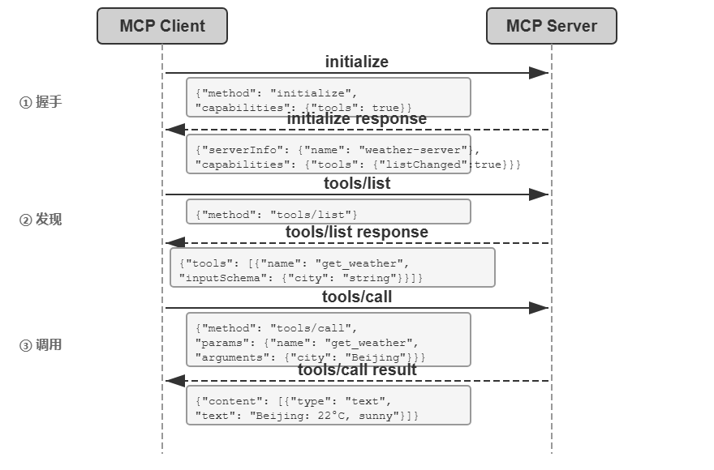

## 分类
**感知工具**是 Agent 主动获取信息、感知世界的方式。例如，网络搜索工具（web_search）、内部知识库检索工具（knowledge_base_search）、阅读网页工具（fetch_url）、搜索文件名工具（find_file）、搜索文件内容工具（grep_file）、读文件工具（read_file）。感知工具的设计关键在于*粒度权衡和输出信息量*的控制。

**执行工具**是 Agent 改变外部世界的方式。例如，命令行工具（shell_exec）、代码解释器工具（code_interpreter）、写文件工具（write_file）、编辑文件工具（edit_file）、发送邮件工具（send_email）。与感知工具不同，*执行工具的错误代价可能极高，安全约束是其设计的核心*。

**协作工具**是 Agent 与其他 Agent 及人类协作的方式。例如，创建子 Agent（spawn_subagent）、给子 Agent 发送消息（send_message_to_subagent）、取消子 Agent（cancel_subagent）、发现系统中可用的 Agent（list_agents）。Agent 之所以需要协作，最简单的原因是并行执行不相关的多个任务，例如并行调研 OpenAI 的多个联合创始人；更复杂的原因是使用不同的模型、工具、提示词和上下文执行不同的任务，实现更好的效果。

**用户沟通工具**是 Agent 主动向用户传递信息的方式。例如，回复用户消息（reply_to_user）、发送结构化卡片消息（send_card_to_user）、发送用户通知提醒（send_user_notification）。

**事件触发工具**是外部世界驱动 Agent 行动的方式。例如，设置定时器（set_timer）、监控后台命令行任务（monitor_shell）、连接外部事件源（connect_channel）。这类工具涉及两个时刻：注册时由 Agent 主动调用工具，声明自己关心什么事件；触发时由外部事件异步回调，唤醒 Agent 开始处理——Agent 注册、外部触发。

### 工具粒度的权衡
粒度过细会导致工具数量激增，增加 LLM 的选择负担；  
粒度过粗又会使单个工具过于复杂。当工具数量过多时（比如超过 100 个），即使是最先进的大语言模型也容易在工具选择上出错。

### 工具的通用性
**通用工具优于专用工具**，除非存在明确的安全、权限或性能理由

LLM 本身具有强大的思考和代码生成能力，我们应该利用这种能力而不是限制它。提供通用工具相当于给 Agent 一个“元能力”——一个 Python 解释器就可以代替数十个特定功能的工具，还能处理预先没有想到的边缘场景。

### 工具描述
工具描述的核心是让 LLM 知道“什么时候用”，而不只是“能做什么”。以网络搜索为例，说“搜索相关内容”远不如说“当需要获取实时信息或查找未知事实时使用”

边界同样重要。**清晰列出工具的边界条件——做不到什么、不接受什么输入——往往比描述能力本身更重要**

## 感知工具
感知工具是 Agent 获取外部信息的主要渠道。  
感知工具常常面临返回**信息量远超 Agent 处理能力的挑战**:

1. 通用的应对可以是第二章提到的**上下文感知压缩**，基于 Agent 当前的查询意图自动压缩
2. **搜索类工具的返回格式与分页**：搜索工具的返回值应该是结构化的候选列表（标题、位置、摘要片段），而非全文拼接——让 Agent 先浏览候选，再决定深入读取哪一条。当结果数量较多时，应提供分页或游标（cursor）参数：默认只返回前若干条，并在返回值中注明结果总数和获取下一页的方式，由 Agent 自主决定是否继续翻页，而不是一次性倾倒全部结果。
3. **读取类工具的 offset/limit 与截断策略**：read 类工具应支持 offset/limit 参数，按需读取大文件的指定片段。当内容超过阈值必须截断时，截断应显式可见：注明省略了多少内容、如何读取剩余部分（如“已显示第 1-200 行，共 5000 行，可用 offset 参数继续读取”）

## 执行工具
执行工具的设计需要在**能力开放**和**安全约束**之间取得微妙的平衡

1. **安全机制的层次化设计**: 例如输入验证，权限控制等
2. **自动验证与反馈闭环**：如果操作结果可以被验证，就应该自动验证。“执行-验证-反馈”闭环（如写代码后自动运行 linter）
3. **执行环境的隔离与沙盒**：理想的实现方式是在沙盒环境中运行，与宿主机隔离

## 协作工具
任务超出单个 Agent 的能力边界时，协作工具可以让它把子任务委托给其他 Agent 或人类，再整合各方的结果

子代理是独立的 AI 助手，拥有专属系统提示词、独立上下文和受控工具集，可自主完成特定任务后返回结果

## MCP

## 主动工具发现
传统做法是把所有工具的 schema 一次性注入系统提示词，但当工具数量上千时它迅速失效：上下文被“工具说明书”塞满，模型的选择精度随之下降。

**从被动选择到主动发现**：  
让 Agent 从被动接受者变为主动发现者：在执行过程中意识到能力缺口时，主动用自然语言声明“我需要什么能力”，系统再动态匹配并注入

MCP-Zero是代表工作——系统提示词中不预置任何工具 schema，Agent 在思考中生成结构化请求块（如“GitHub 服务器：搜索仓库并返回元数据”），系统通过服务器级→工具级的两层语义路由从数千候选中匹配注入