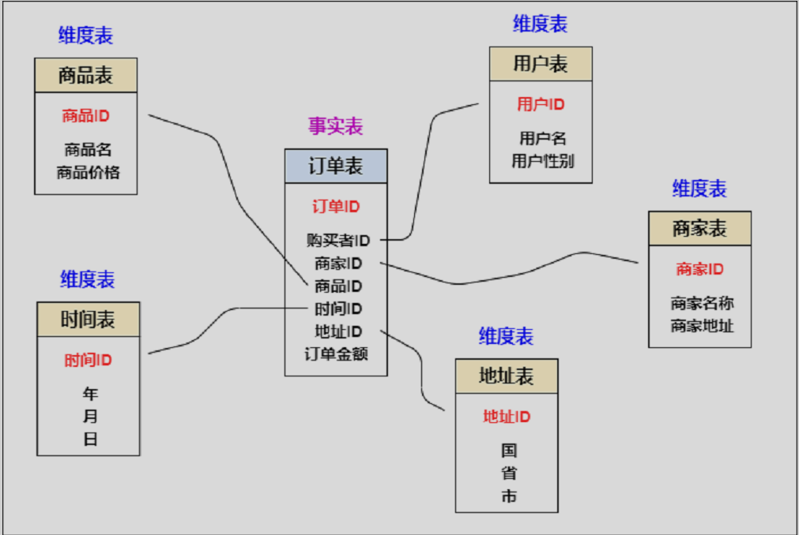
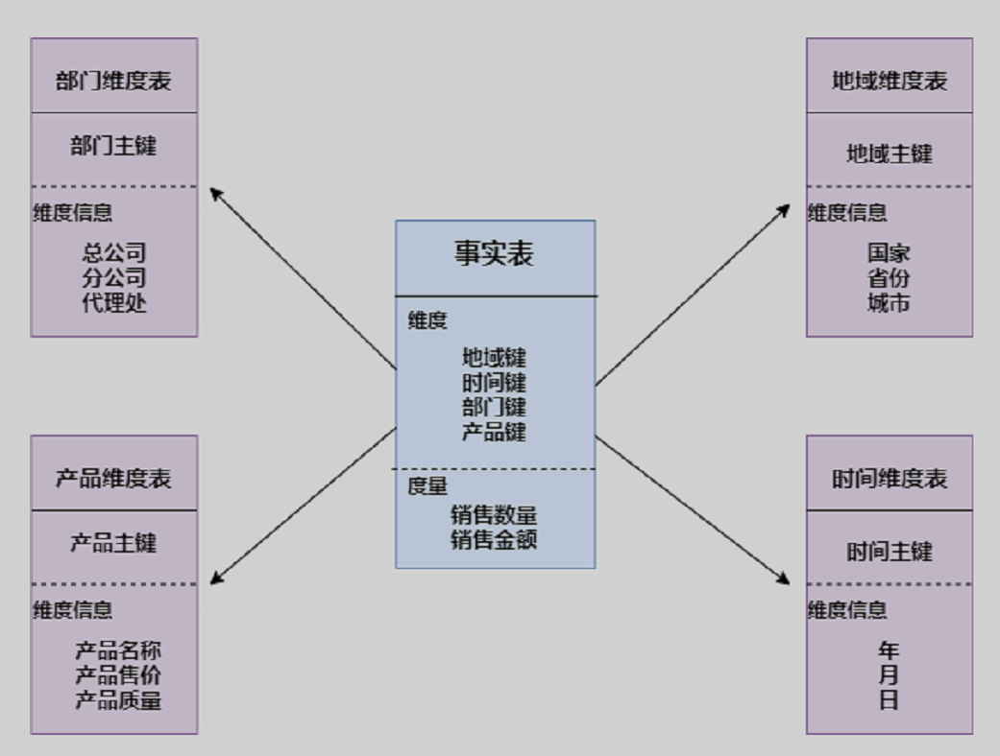
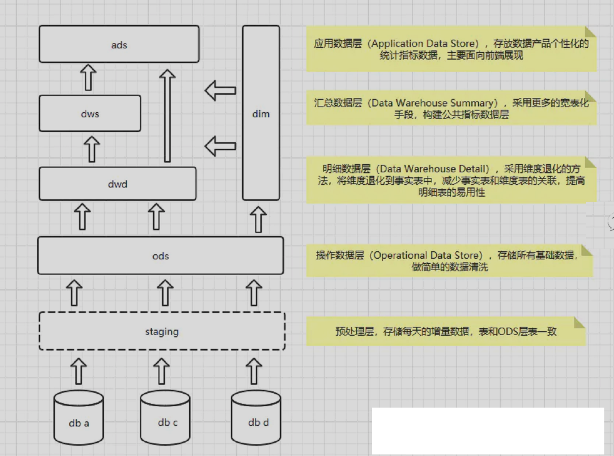
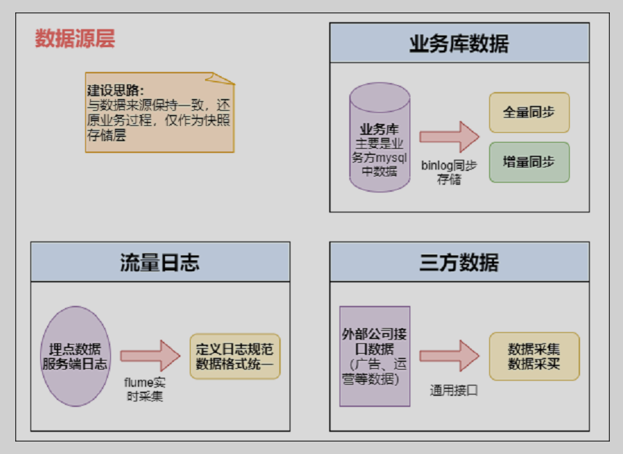
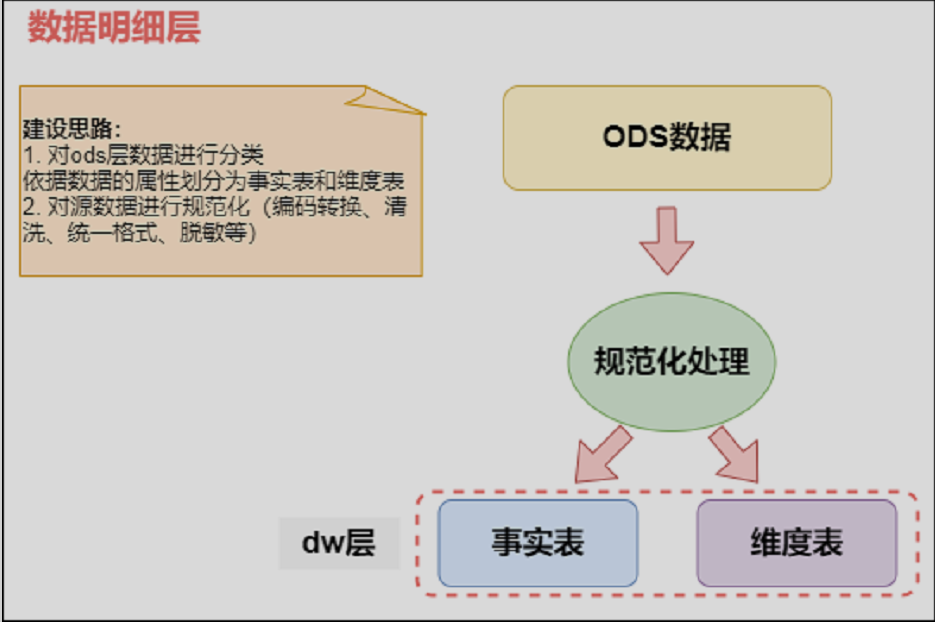

## 维度建模

### 事实表
现实中发生的一次操作型事件  
特征：**表里没有存放实际的内容，他是一堆主键的集合，这些ID分别能对应到维度表中的一条记录。**

事实表包含了与各维度表相关联的外键，可与维度表关联。  
事实表的度量通常是数值类型，且记录数会不断增加，表数据规模迅速增长。

### 维度表
每个维度表都包含**单一的主键列**

### 维度建模的模式
星型模式，雪花模式，星座模式

主要看下星形模式：

## 数仓分层

### 数据层的具体实现
数据源层ODS

数据明细层DW

数据轻度汇总层DM  
...

数据应用层APP  
在离线数仓中，我们一般叫做ADS层 