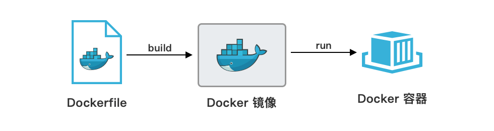

## 核心概念
- 容器：一种虚拟化技术，它共享操作系统内核但保持独立的运行环境
- 镜像：镜像是用于创建容器的模板，它包含了*运行应用所需的代码、库和配置文件*，用户可以从 Docker Hub 下载现成镜像或自己构建。
- Dockerfile：文本文件，里面写明了**如何一步步构建镜像**，通过执行 Dockerfile 中的指令，Docker 能自动生成镜像。
- 镜像仓库：存储和分发镜像的地方。

虚拟机的隔离性更强，因为每个虚拟机有完全独立的操作系统，适合运行需要强隔离的不同类型应用。  
Docker 的隔离性主要依靠 Linux 内核的命名空间和控制组功能，虽然隔离程度不如虚拟机，但对于大多数应用场景已经足够。

## Docker Compose
核心是 `docker-compose.yml` 文件，作用是:  
一键启动/停止整个应用栈  
用一个YAML文件定义和运行多个容器的应用  
开发环境标准化：团队成员用同一份配置，消除"我本地能跑"问题

Docker Compose 文件包含了容器镜像、端口映射、数据卷、环境变量等配置，所有配置集中在一个文件中，便于版本控制和团队协作