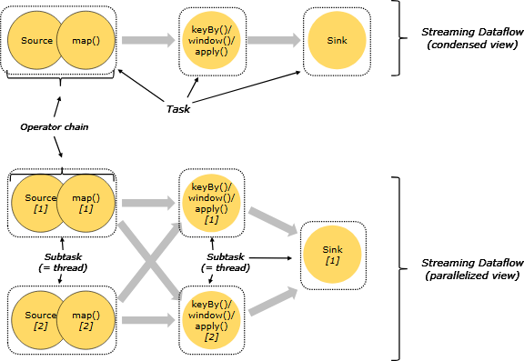
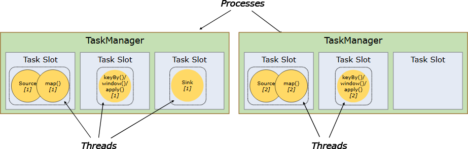
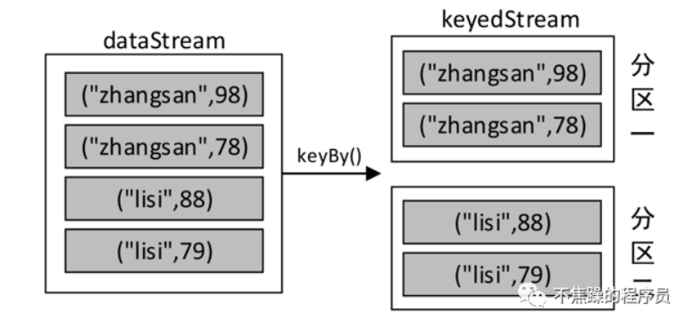
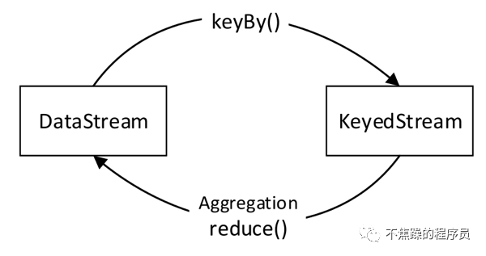
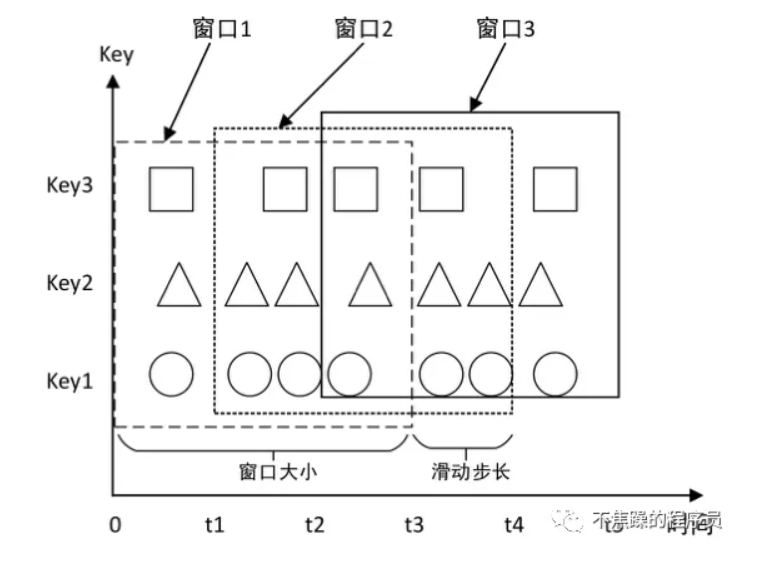

##  批处理与流处理
批处理的特点是有界、持久、大量，批处理非常适合需要访问全套记录才能完成的计算工作，一般用于离线统计。

流处理的特点是无界、实时，流处理方式无需针对整个数据集执行操作，而是对通过系统传输的每个数据项执行操作，一般用于实时统计。

*Flink 将批处理（即处理有限的静态数据）视作一种特殊的流处理。*

## 算子
Flink提供了丰富的用于数据处理的*函数*，这些函数称为算子。说白了就是Flink提供了一系列处理数据的函数给你调用。

## 运行架构




- JobManager： 根据客户端提交的应用将应用分解为子任务，从资源管理器（YARN等）申请所需的计算资源，然后分发任务到TaskManager执行，并跟踪作业的执行状态等
- TaskManager： *每个 worker（TaskManager）都是一个 JVM 进程*，都可以在单独的线程中执行一个或多个 subtask。为了控制一个 TaskManager 中接受多少个 task，就有了所谓的 task slots。
- Task：Task是基本的工作单元，由Flink的Runtime来执行。每个 task 由一个线程执行
- Task Slot：计算资源（内存）被划分为多个Task Slot。


## Flink程序结构
1. 获取执行环境
2. 加载／创建初始数据
3. 对初始数据进行转换
4. 指定计算结果的输出位置
5. 触发程序执行
```java
public static void main(String[] args) throws Exception {
        // 1. 创建执行环境
        StreamExecutionEnvironment env = StreamExecutionEnvironment.getExecutionEnvironment();

        // 2. 读取数据源
        RandomStudentSource randomStudentSource = new RandomStudentSource();
        DataStreamSource<Student> dataStreamSource = env
                .addSource(randomStudentSource);

        // 3. 数据转换
        DataStream<Student> transformedStream = dataStreamSource
                .keyBy(student -> student.name)
                .reduce((a, b) -> new Student(a.name, a.score + b.score));

        // 4. 数据输出。字节输出到控制台或者Log日志
        // transformedStream.print("result =======").setParallelism(1);
        transformedStream.addSink(new AlertSink());

        // 5. 启动任务
        env.execute(SourceSourceDemo.class.getSimpleName());
    }
```

## Transformation数据转换


- keyBy： 作用于元素类型是元组或数组的DataStream上。使用该算子可以将DataStream中的元素按照指定的key（指定的字段）进行分组，具有相同key的元素将进入同一个分区中
- reduce：作用于KeyedStream上，对KeyedStream数据流进行滚动聚合，即将当前元素与上一个聚合值进行合并，并且发射出新值




## 窗口
事件时间（Event Time）：事件时间是指每个事件或元素在其生产设备上产生的时间。

处理时间（Processing Time）：处理时间是指正在执行相应Flink操作的机器的系统时间。

窗口是处理无限流的核心。窗口将流分成有限大小的“桶”，我们可以在其上应用算子计算。  
window()作用于KeyedStream上，windowAll()作用于非KeyedStream上（通常指DataStream）
### 滚动窗口
滚动窗口具有固定的大小，并且不重叠。
### 滑动窗口
窗口大小和滑动步长

例如，每隔5分钟需要对最近10分钟的数据进行计算，就可以设置窗口大小为10分钟，滑动步长为5分钟。这样，每隔5分钟就会得到一个窗口，其中包含最近10分钟内到达的数据。



