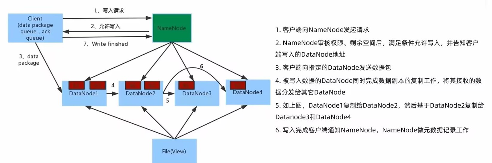
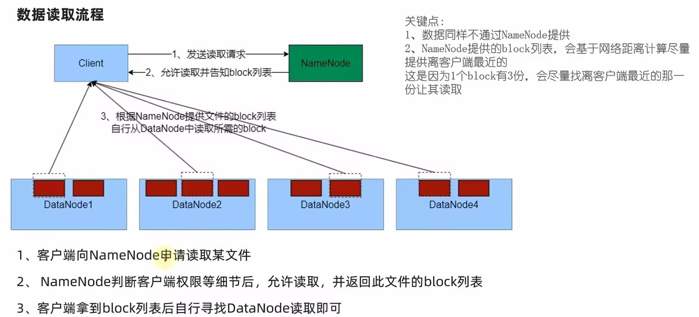

## 基础架构
- NameNode，HDFS系统的主角色，独立的进程，*管理整个文件系统*，默认端口9870
- DataNode，负责处理来自文件系统客户端的*读写*请求
- Secondary NameNode 主角色的辅助

## 命令行接口
```
hdfs dfs [COMMAND [COMMAND_OPTIONS]]
hadoop fs ...

hadoop fs -ls -R /
hadoop fs -mkdir -p /mengqiu
hadoop fs -put ~/zhixia.txt /mengqiu (linux-->hdfs)
...
```


## Blocks
HDFS的Block块比一般单机文件系统大得多，默认为128M  
Hadoop提供的df、fsck这类运维工具都是在文件系统的Block级别上进行操作。

## 副本机制
HDFS中，一个文件会被拆分为一个或多个数据块。默认每个数据块有三个副本(dfs.replication=3)，每个副本都存放在不同机器

## 读写流程
写入



读取

