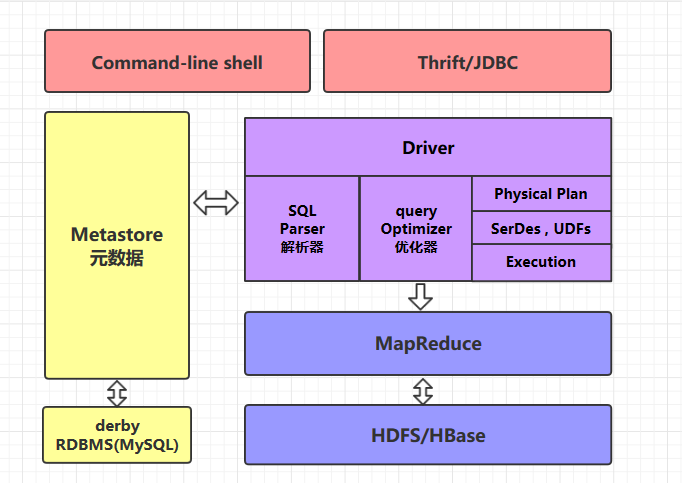

## Hive本质
将HQL（hiveSQL）转化成MapReduce程序

两大主要组件：SQL解析器，元数据管理



## 元数据管理
所有的元数据默认存储在 Hive 内置的 derby 数据库中，但由于 derby 只能有一个实例，也就是说不能有多个命令行客户端同时访问，所以在实际生产环境中，通常使用 *MySQL* 代替 derby。


## SQL
```sql
create table test(id int, name string, gender string);
insert into test values(1, '王力宏','男'),(2, '周杰伦','男'),(3, '林志灵','女');         ----> 转换为mapreduce运行
select gender, count(*) as cnt from test group by gender;           ----> 转换为mapreduce运行
``` 


## 表

### 分区表
Hive 中的表对应为 HDFS 上的指定目录

**分区为 HDFS 上表目录的子目录**，数据按照分区存储在子目录中。如果查询的 where 子句中包含分区条件，则直接从该分区去查找，而不是扫描整个表目录，合理的分区设计可以极大提高查询速度和性能。

### 分桶表
分桶表会将指定列的值进行哈希散列，并对 bucket（桶数量）取余，然后存储到对应的 bucket（桶）中，类似于hashmap

例如：
```sql
CREATE EXTERNAL TABLE emp_bucket(
    empno INT,
    ename STRING,
    job STRING,
    mgr INT,
    hiredate TIMESTAMP,
    sal DECIMAL(7,2),
    comm DECIMAL(7,2),
    deptno INT)
    CLUSTERED BY(empno) SORTED BY(empno ASC) INTO 4 BUCKETS  --按照员工编号散列到四个 bucket 中
    ROW FORMAT DELIMITED FIELDS TERMINATED BY "\t"
    LOCATION '/hive/emp_bucket';
```