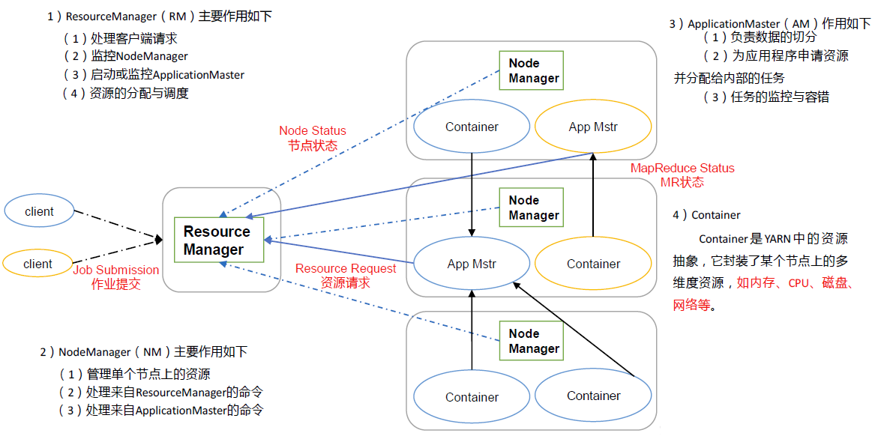

## 概览
yarn用于做集群的资源（内存，cpu）调度，提高资源利用率

## 基本架构



- ResourceManager(主)：管理整个*集群*的计算资源，默认端口8088
- NodeManager(从)：管理*单个服务器*的资源

- ApplicationMaster：本质是一个特殊的container，管理其他的container。只有在任务的整个生命周期内，AM才是启动状态，当任务执行完毕，AM消失，不需要监控  
- Container：Yarn将CPU核数，内存这些计算资源都封装成为一个个的容器；例如container(1cpu,2G)

### 辅助角色
- proxyserver：代理服务器，统一网关，自动把请求转发到对应 ApplicationMaster 的真实地址  
- YARN 上跑的应用（如 MapReduce、Spark）各自有一个 Web UI（ApplicationMaster 自带的），但这些 UI 分散在不同的 NodeManager 节点上，端口也是随机的。
- jobhistoryserver：统一收集日志和运行信息到HDFS中（日志聚合，因为每个容器都有自己的日志），然后历史服务器通过web UI 让用户在浏览器统一查看。默认端口19888


## 示例
```sh
start-dfs.sh # 启动HDFS
start-yarn.sh # 启动yarn
bin/mapred --daemon start historyserver # 启动历史服务器

hadoop fs -mkdir -p /input
hadoop fs -mkdir -p /output

hadoop fs -put words.txt /input

# 提交map reduce 任务wordcount 到 yarn
hadoop jar /export/server/hadoop/share/hadoop/mapreduce/hadoop-mapreduce-examples-3.3.5.jar wordcount hdfs://node1:8020/input hdfs://node1:8020/output/wc

# 查看结果 或者 http://node1:8020
hadoop fs -cat hdfs://node1:8020/output/wc/part-r-00000
English 3
ai      2
dash    1
love    6
math    3

```