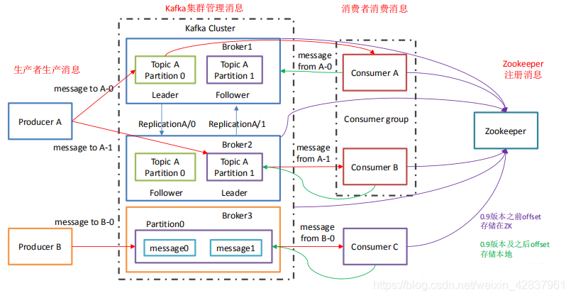
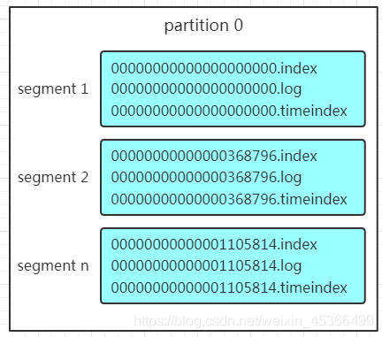
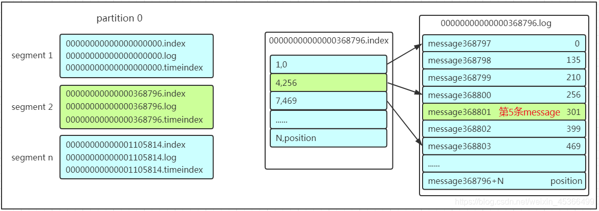

## 消息队列的两种形式
- 点对点模式（一对一，消费者主动拉取数据，消息收到后消息清除。）
- 发布 / 订阅模式（一对多，消费者消费数据之后*不会清除消息*）

## 基础架构

Producer：消息生产者，就是向 Kafka broker 发消息的客户端。

Consumer：消息消费者，向 Kafka broker 取消息的客户端。

Consumer Group（CG）：同一个消费组者的消费者可以消费同一topic下不同分区的数据，但是不能消费同一分区的数据

Broker：一台 Kafka 服务器就是一个 broker。一个集群 cluster 由多个 broker 组成。一个 broker 可以容纳多个 topic。

Topic：可以理解为一个队列，生产者和消费者面向的都是一个 topic。

Partiton：一个非常大的 topic 可以分布到多个 broker（即服务器）上，一个 topic 可以分为多个 Partition，每个 partition 都是一个有序的队列。

Replication: 分区的副本

## Partition 结构
每个topic都可以分为一个或多个partition

Partition在服务器上的表现形式就是一个一个的文件夹，每个partition的文件夹下面会有多组segment文件，每组segment文件又包含.index文件、.log文件、.timeindex文件  
*log文件就实际是存储message的地方*，而index和timeindex文件为*索引文件*，用于检索消息。

每个log文件的大小是一样的，但是存储的message数量是不一定相等的（每条的message大小不一致）。

文件的命名是以该segment最小offset来命名的，如**000.index存储offset为0~368795的消息**，kafka就是利用分段+索引的方式来解决查找效率的问题。

## 查找消息
假如现在需要查找一个offset为368801的message

1. 先找到offset的368801message所在的segment文件（利用二分法查找），这里找到的就是在第二个segment文件。
2. 找到的segment中的.index文件， 该文件采用的是稀疏索引的方式存储着*相对offset*及*对应message物理偏移量*的关系，我们要查找的offset为368801的message在该index内的偏移量为368796+5=368801，所以这里要查找的相对offset为**5**
3. 根据找到的相对offset为4的索引确定message存储的物理偏移位置为256。打开数据文件，从位置为256的那个地方开始顺序扫描直到找到offset为368801的那条Message。