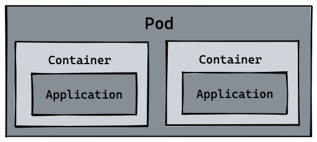
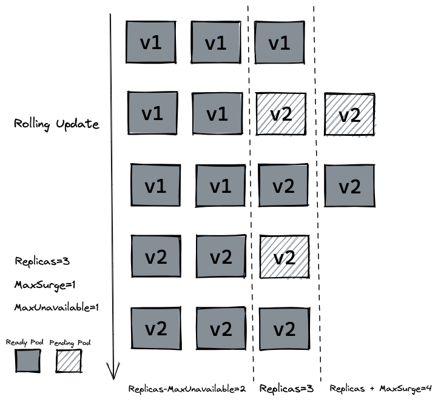
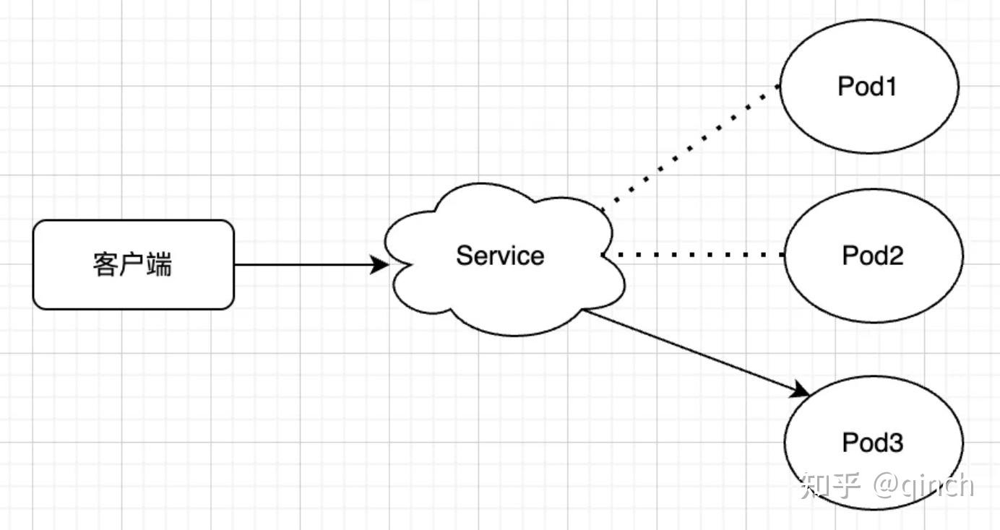
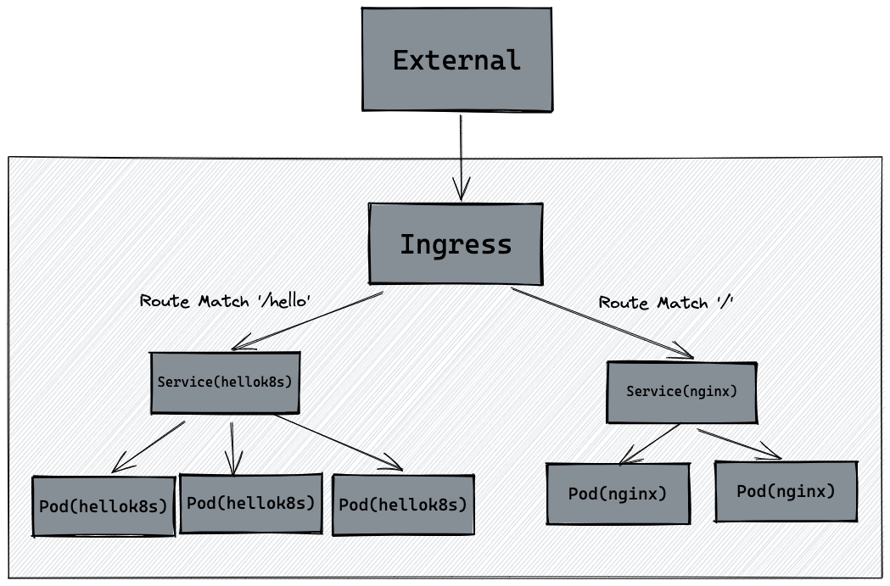

## 学习命令
启动 minikube
`minikube start --vm-driver docker --container-runtime=docker`

## Pod
**Kubernetes 的最小调度/运行单元，直接装着容器**

容器被设计为每个容器只运行一个进程，但是容器之间是彼此完全隔离的，多个进程分布在对应的多个容器中，*进程之间无法做到资源共享*
（比如，前边提到到生产者/消费进程，他们通过共享内存和信号量来通信，但是如果生产者进程和消费者进程分布在两个容器中，则IPC是相互隔离的，导致无法通信）

- 可以把pod看作一个独立的机器，一个pod中可以运行一个或者多个容器，这些容器之间共享相同的ip和port空间。
- 一个pod的所有容器都运行在同一个woker node中，一个pod不会跨越两个worker node

## deployment
### label
Label（标签）是一个可以附加到K8s对象（比如Pod，Worker Node等）上的任意key-value对（一个Label就是一个key/value对，每个资源可以拥有多个Label, 并且可以随时进行添加和修改）， 然后通过Selector(标签选择器)来选择具有相应Label的K8s对象。

Pod：一栋楼里的一间房，里面住着程序（container）。  
Deployment：物业管理者，负责保证「这栋楼永远有 3 间房」，房间塌了立刻补盖，要升级装修就一间一间换，还能一键恢复上一版装修。

当手动删除一个 pod 资源后，deployment 会自动创建一个新的 pod，这和我们之前手动创建 pod 资源有本质的区别！  
这代表着当生产环境管理着成千上万个 pod 时，我们不需要关心具体的情况，只需要维护好这份 deployment.yaml 文件的资源定义即可。

### 滚动更新
如果我们在生产环境上，管理着多个副本的 hellok8s:v1 版本的 pod，我们需要更新到 v2 的版本，像上面那样的部署方式是可以的，但是也会带来一个问题，就是所有的副本在同一时间更新，这会导致我们 hellok8s 服务在短时间内是不可用的，因为所有 pod 都在升级到 v2 版本的过程中，需要等待某个 pod 升级完成后才能提供服务。

设置 strategy=rollingUpdate , maxSurge=1 , maxUnavailable=1 和 replicas=3 到 deployment.yaml 文件中。这个参数配置意味着最大可能会创建 4 个 hellok8s pod (replicas + maxSurge)，最小会有 2 个 hellok8s pod 存活 (replicas - maxUnavailable)。

## Service
Service是将运行在一个或一组Pod上的网络应用程序公开为网络服务的方法

在K8s集群中，可能多个Pod副本运行着相同的容器，此时客户端可能并不关心每个Pod的IP，而是期望通过一个单一不变的IP地址进行访问这些Pod（最终由Service后端的某一个Pod来提供服务）。

## Ingress
Ingress 公开从集群外部到集群内服务的 HTTP 和 HTTPS 路由。 

流量路由由 Ingress 资源上定义的规则控制。Ingress 可为 Service 提供外部可访问的 URL、负载均衡流量、 SSL/TLS，以及基于名称的虚拟托管

