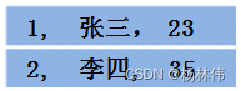
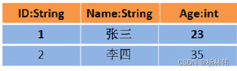
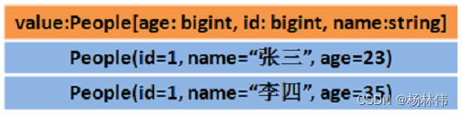

##  Spark 优势
MapReduce，它提供了对数据访问和计算的抽象，但是对于数据的*复用*就是简单的将中间数据写到一个稳定的**文件系统**中(例如 HDFS)，所以会产生数据的复制备份，磁盘的I/O以及数据的序列化，所以在遇到需要在多个计算之间复用中间结果的操作时效率就会非常的低。

Spark 基于内存的运算要快 100 倍以上，基于硬盘的运算也要快 10 倍以上。  
Spark 实现了高效的 DAG 执行引擎，可以通过基于内存来高效处理数据流。

## RDD
1. RDD **不实际存储真正要计算的数据**，而是记录了数据的位置在哪里，数据的转换关系(调用了什么方法，传入什么函数)。
2. RDD 中的所有转换transformation都是**惰性求值/延迟执行**的，也就是说并不会直接计算。只有当发生一个要求返回结果给 Driver 的 Action动作时，这些转换才会真正运行。

### 持久化/缓存
MORY_ONLY（默认）：是将 RDD 以非序列化的 Java 对象存储在 JVM 中。如果没有足够的内存存储 RDD，则某些分区将不会被缓存，每次需要时都会重新计算。这是默认级别
MORY_AND_DISK：一般开发中

### Checkpoint
Checkpoint 的产生就是为了*更加可靠的数据持久化*，在Checkpoint的时候一般把数据放在在 `HDFS`上，这就天然的借助了 HDFS 天生的高容错、高可靠来实现数据最大程度上的安全，实现了 RDD 的容错和高可用。

### 依赖关系
- 窄依赖：父 RDD 的一个分区只会被子 RDD 的一个分区依赖；
- 宽依赖：父 RDD 的一个分区会被子 RDD 的多个分区依赖(涉及到 shuffle)。

### DAG 的 stage
- 对于窄依赖，partition 的转换处理在 stage 中完成计算，不划分(将窄依赖尽量放在在同一个 stage 中，可以实现流水线计算)。
- 对于宽依赖，由于有 shuffle 的存在，只能在父 RDD 处理完成后，才能开始接下来的计算，也就是说需要要划分 stage。

## Spark SQL
SparkSQL 主要用于处理结构化数据(较为规范的半结构化数据也可以处理)。

### DataFrame 和 DataSet

- DataFrame：DataFrame 是一种以 RDD 为基础的分布式数据集，类似于传统数据库的二维表格，*带有 Schema 元信息(可以理解为数据库的列名和类型)*。DataFrame = RDD ＋ 泛型 + SQL 的操作 + 优化
- DataSet：DataSet是DataFrame的进一步发展，它比RDD保存了更多的描述信息，概念上等同于关系型数据库中的二维表，它保存了类型信息，是强类型的，提供了编译时类型检查。

RDD[Person]：以 Person 为类型参数，但不了解其内部结构。  

DataFrame：提供了详细的结构信息 schema 列的名称和类型。这样看起来就像一张表了。  

DataSet[Person]：不光有 schema 信息，还有类型信息。  
